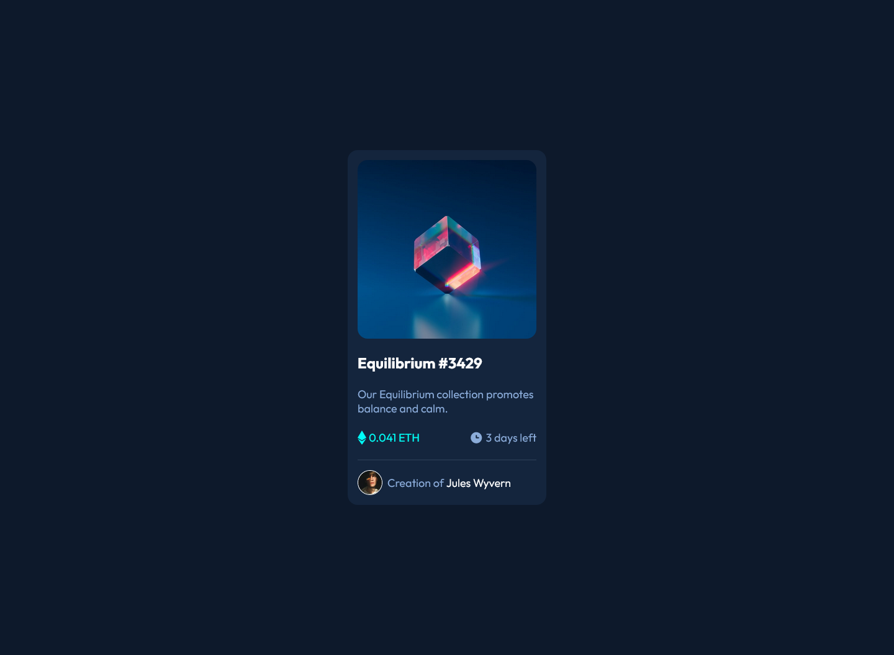
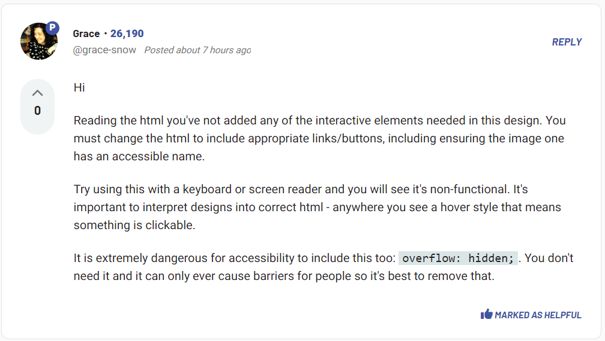

# Frontend Mentor - NFT preview card component solution

This is a solution to the [NFT preview card component challenge on Frontend Mentor](https://www.frontendmentor.io/challenges/nft-preview-card-component-SbdUL_w0U). Frontend Mentor challenges help you improve your coding skills by building realistic projects. 

## Table of contents

- [Overview](#overview)
  - [The challenge](#the-challenge)
  - [Screenshot](#screenshot)
  - [Links](#links)
- [My process](#my-process)
  - [Built with](#built-with)
  - [What I learned](#what-i-learned)

## Overview

### The challenge

Users should be able to:

- View the optimal layout depending on their device's screen size
- See hover states for interactive elements

### Screenshot



### Links

- Solution URL: [Code](https://github.com/phangtono/NFT-preview-card-component)
- Live Site URL: [Live Site URL](https://roaring-sawine-0e6002.netlify.app/)

## My process

### Built with

- Semantic HTML5 markup
- Flexbox
- CSS Grid
- Mobile-first workflow

### What I learned

I use background to display image-equilibrium.jpg, for background color (:after) and svg normal condition display:none, once hovered, display:block

```css
.card-image{
    background: var(--clr-primary-cyan) url('images/image-equilibrium.jpg');
    background-size:cover;
    width: 100%;
    aspect-ratio: 1;
    border-radius: var(--gap);
    
    display: flex;
    justify-content: center;
    align-items: center;
    cursor: pointer;
    position: relative;
}

.card-image svg{
    display: none;
}

.card-image::after{
    position: absolute;
    content: '';
    width: 100%;
    aspect-ratio: 1;
    opacity: .4;
    background-color: var(--clr-primary-cyan);
    display: none;
    border-radius: var(--gap);
}

.card-image:hover svg{
    display: block;
    z-index: 1;
}

.card-image:hover::after{
    display: block;
}

```



After studying input from mentor @grace, I added the ahref tag to the interactive section.

```html
<a href="#">
<div class="card-image">
    <svg width="48" height="48" xmlns="http://www.w3.org/2000/svg">
    <g fill="none" fill-rule="evenodd">
        <path d="M0 0h48v48H0z"/>
        <path d="M24 9C14 9 5.46 15.22 2 24c3.46 8.78 12 15 22 15 10.01 0 18.54-6.22 22-15-3.46-8.78-11.99-15-22-15Zm0 25c-5.52 0-10-4.48-10-10s4.48-10 10-10 10 4.48 10 10-4.48 10-10 10Zm0-16c-3.31 0-6 2.69-6 6s2.69 6 6 6 6-2.69 6-6-2.69-6-6-6Z" fill="#FFF" fill-rule="nonzero"/>
    </g>
    </svg>  
</div>  
</a>
<h1 class="card-title"><a href="#">Equilibrium #3429</a></h1>
<div class="card-owner">
    
    <p class="card-owner-description">Creation of <a href="#">Jules Wyvern</a></p>
</div>          
```